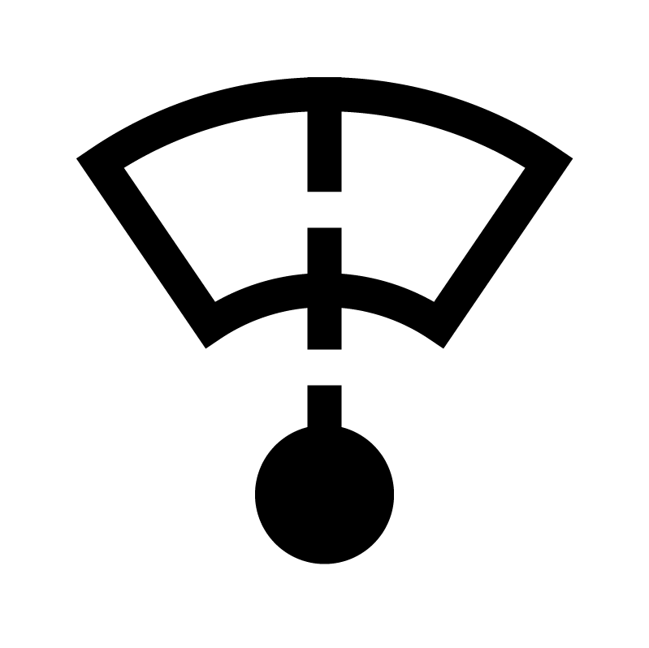
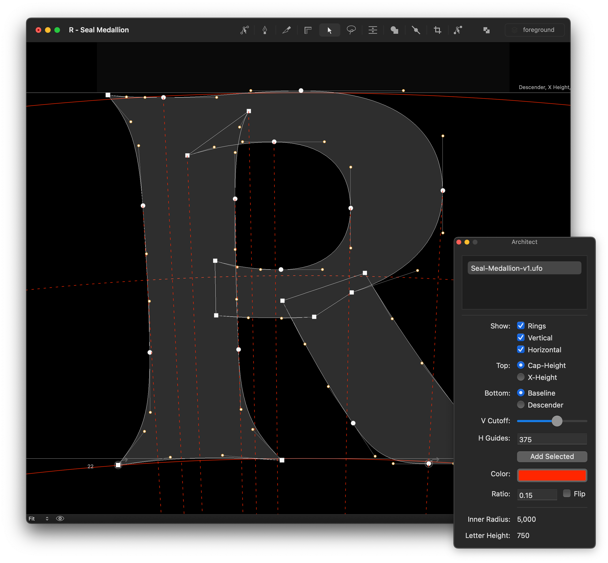
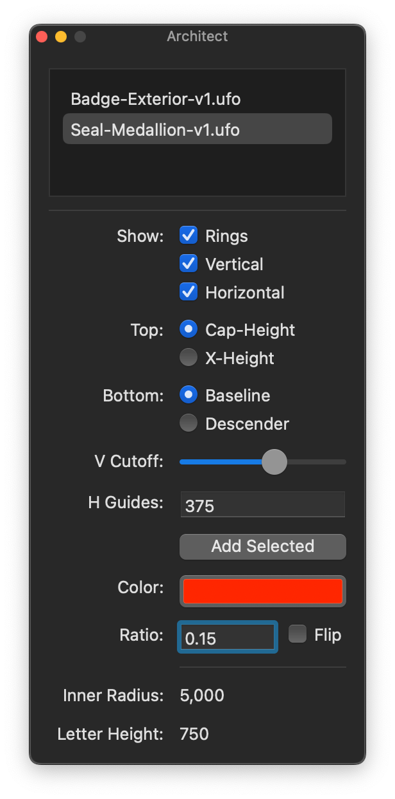

# Architect
A RoboFont extension that provides dynamic guides for drawing type along curves.

## Overview

For any given UFO, you may specify a radius ratio of a curve to set serve as the basis for Architect’s custom guidelines. Architect will store this information alongside your UFO, and you can use the Architect window to toggle and tweak the visuals.

## A tour of the interface

### Font Table

This is a list of all open UFOs. You can make display changes to any or all of the selected UFOs, and this display settings will only update in the corresponding UFO.

### Show

Toggle the visibility of the rings, dynamic vertical guides, and horizontal guides.

### Top

Choose which font dimension should define the top of the ring.

### Bottom

Choose which font dimension should define the bottom of the ring.

### Vertical Cutoff

“Vertical” (orthogonal) guides start from on-curve points and lead to the centerpoint of the arc. If you draw guides from every point, that’s probably way too many to be useful. You can slide this slider to choose the cutoff y-position.

### Horizontal Guides

Specify y-coordinates, separated by spaces, to place curved horizontal guides. You may also select points and click **Add Selected** to add horizontal guides there.

### Color

Choose the color of the guides.

### Ratio

Specify the ratio of the radii between the inside curve and the outside curve. The bigger the ratio, the bigger the letter and tighter the curve. You may **Flip** the arc guides if you’re drawing with the top of the glyph pointing inward.

### Info

This area calculates the inner radius depending on the specified ratio and letter height. For display only.

## Acknowledgements

- Frederik Berlaen: RoboFont
- Tal Leming: EZUI, Subscriber, Merz
